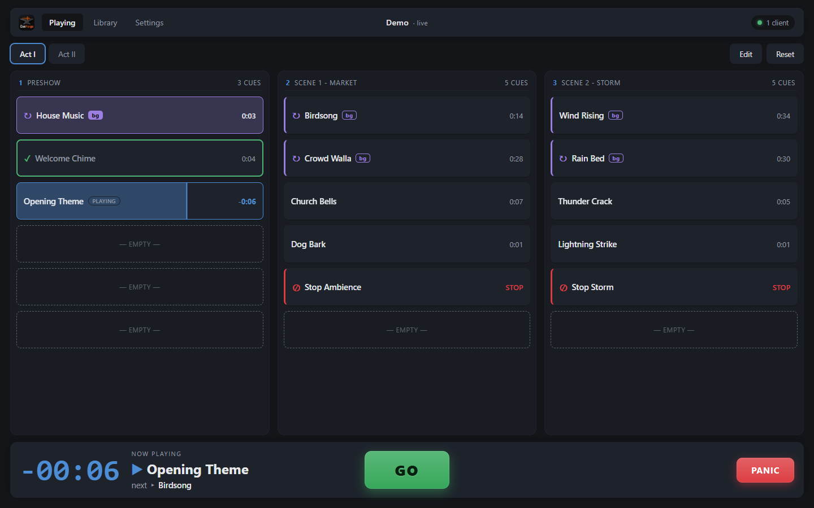
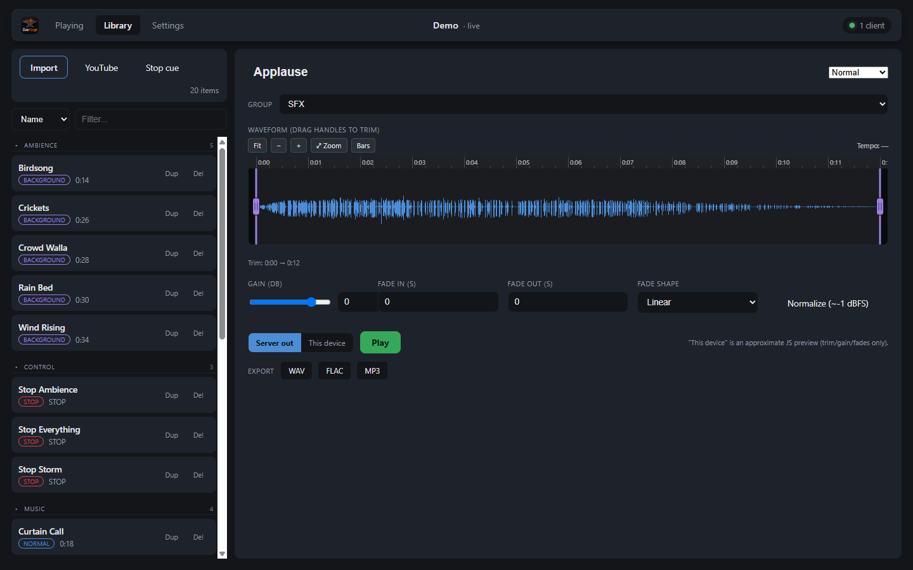
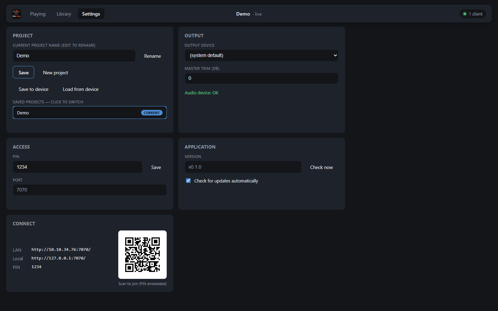

# CueForge

[](https://lesani.github.io/CueForge/)
[](https://github.com/Lesani/CueForge/releases/latest)
[](LICENSE)
[](https://ko-fi.com/lesani)

**➜ [lesani.github.io/CueForge](https://lesani.github.io/CueForge/)** — project
website: what CueForge does, screenshots, and downloads.

A reliable, server-side **audio cue system for amateur and small-scale
productions** — amateur theatre, community stages, dance, school and church
events, small venues — driven from a browser. Run the server on the booth
machine, then control the show from any browser on the network — laptop,
tablet, or phone. Multiple clients share one live show state.

The machine running the server is the one that produces the audio (it feeds the
sound board), so cue playback is centralized and deterministic; the browsers are
just controllers.

## Built for the small stage

CueForge deliberately does **less** than professional show-control suites.
Amateur productions run on limited time, borrowed hardware, and crews that
change from show to show — so the tool should be learnable in an afternoon
and dependable on show night:

- **Fire cues, in order, reliably.** A grid of buttons and a big GO. No
  scripting, no MIDI routing matrices, no session concepts.
- **Plain language everywhere.** Volume instead of gain staging, "Plays as
  Background" instead of bus assignments, fades you drag directly on the
  waveform.
- **One file per show.** Carry the whole production on a USB stick; open it on
  another machine and it plays.

If you need SMPTE timecode, MIDI control, or many-bus routing, have a look at
[LivePlay](https://tdoukinitsas.github.io/liveplay/) — a fellow open-source
(AGPL) cue system with a professional feature set. If you need tonight's show
to just work from a laptop and a pair of speakers (or a handful of them),
CueForge is for you.



## Download (Windows)

Grab the prebuilt `CueForge.exe` from the
[latest release](https://github.com/Lesani/CueForge/releases/latest) — no
install needed, just run it. It prints a URL, PIN, and a scannable QR code, and
opens the control UI in your browser.

CueForge keeps itself current: it checks GitHub for new releases (Settings →
Application, can be turned off) and updates itself with one click — download,
swap, restart.

Running from source instead? See [Quick start](#quick-start-from-source) below.

## Features

- **Playing view** — a page/column grid of cues. `GO` advances column-major
  through the current page; tap any cue to fire it directly. A moving cursor
  marks the next cue, played cues turn green, and a large fixed-width timer
  anchors the bottom bar.
- **Cue model** — exclusive *normal* cues (a new one hard-cuts the previous with
  a declick), stackable looping *background* layers with fade-in, and *stop*
  cues (targeted or all, hard or timed fade). Every cue wears its type in the
  grid — violet stripe + `bg` tag for backgrounds, red stripe for stops — so a
  glance tells you what `GO` will do. A one-tap **PANIC** fast-fades everything.
- **Library** — import audio in any format (decoded to 48 kHz via ffmpeg,
  fetched automatically on first use) or straight from YouTube via yt-dlp.
  Content-hash de-duplication, collapsible groups, filter and sort, per-item
  trim/gain/fades on a zoomable waveform editor, audition preview (server
  output or "this device"), and WAV/FLAC/MP3 export with cue params baked in.
- **Authoring** — edit mode to build pages/columns, place and rearrange cues by
  drag-and-drop (touch included), and drop audio files straight onto grid cells.
- **Portable projects** — a show is a single `.cueforge` file (zip of
  `show.json` + decoded audio); an empty project opens on startup and autosaves.
  **Save to device / Load from device** in Settings downloads or uploads the
  whole show through the browser, so you can carry it to another machine on a
  USB stick (uploads never overwrite — a name clash lands as `Name (2)`).
- **Easy access** — the console prints a URL, PIN, and scannable QR; the
  in-app Settings tab shows the same for tablets. Remote clients need the PIN;
  loopback is trusted. On iPad/iPhone, *Add to Home Screen* gives a true
  fullscreen control surface, and a screen wake lock keeps devices awake
  mid-show.

| Library — waveform editor, groups | Settings — access, output, updates |
|---|---|
|  |  |

## Tech stack

- **Backend:** Python 3.13, FastAPI + uvicorn, WebSockets for live state.
- **Audio:** a NumPy real-time mixer over `sounddevice` (PortAudio); `soundfile`
  (libsndfile/FLAC); `ffmpeg` for decoding on import.
- **Frontend:** vanilla JavaScript ES modules + canvas — **no build step**.
- **Packaging:** PyInstaller (onefile) into a single `CueForge.exe`.

## Quick start (from source)

Requires Python 3.13. `ffmpeg` and `yt-dlp` are **not** needed up front —
CueForge downloads its own copies on first use.

```sh
python -m venv .venv
.venv/Scripts/python.exe -m pip install -r requirements.txt
.venv/Scripts/python.exe -m cueforge
```

Then open the printed URL (default http://localhost:7070/). Press **F11** for
fullscreen. Set the output device in **Settings → Output** before playing.

Want something to click on right away? Generate the demo show from the
screenshots (synthesized audio, no downloads):

```sh
.venv/Scripts/python.exe scripts/make_demo_show.py
```

and open the **Demo** project from Settings → Saved projects.

Environment overrides:

- `CUEFORGE_PORT` — listen port (default `7070`)
- `CUEFORGE_NO_BROWSER=1` — don't auto-open a browser
- `CUEFORGE_FFMPEG` — path to an ffmpeg binary

## Data location

Per-user data lives under `~/CueForge`:

- `config.json` — output device, master trim, PIN, port, update preference
- `projects/*.cueforge` — saved shows
- `work/` — extracted working folders for open projects
- `bin/` — auto-downloaded ffmpeg / yt-dlp

## Contributing

Contributions are welcome. See [CONTRIBUTING.md](CONTRIBUTING.md) for the dev
environment, project layout, tests, building the executable, and how to open a
pull request. When proposing features, keep the project's focus in mind:
CueForge stays small and approachable — features that mainly serve large,
complex productions are usually a better fit for other tools.

If CueForge is useful to you and you'd like to support its development, you can
[buy me a coffee on Ko-fi](https://ko-fi.com/lesani). ♥

## Third-party components

CueForge depends on the Python packages listed in `requirements.txt` (FastAPI,
uvicorn, NumPy, sounddevice/PortAudio, soundfile/libsndfile, soxr, qrcode,
Pillow, and others — each under its own license). In addition, two external
tools are **downloaded on first use** rather than bundled with this repository:

- **[ffmpeg](https://ffmpeg.org/)** — used to decode imported audio. The
  auto-downloaded Windows build comes from [gyan.dev](https://www.gyan.dev/ffmpeg/)
  and is licensed under the GPL/LGPL. Not distributed as part of this project.
- **[yt-dlp](https://github.com/yt-dlp/yt-dlp)** — used for the optional YouTube
  import feature. Released into the public domain (Unlicense). Not distributed as
  part of this project.

Please respect the terms of service of any site you download from.

## License

CueForge is licensed under the **GNU Affero General Public License v3.0 or
later** (AGPL-3.0-or-later). See [LICENSE](LICENSE) for the full text.

Because CueForge is a network-server application, the AGPL requires that if you
run a modified version and let others interact with it over a network, you must
also offer them the corresponding source code of your modified version.

Copyright (C) 2026 Lesani.
